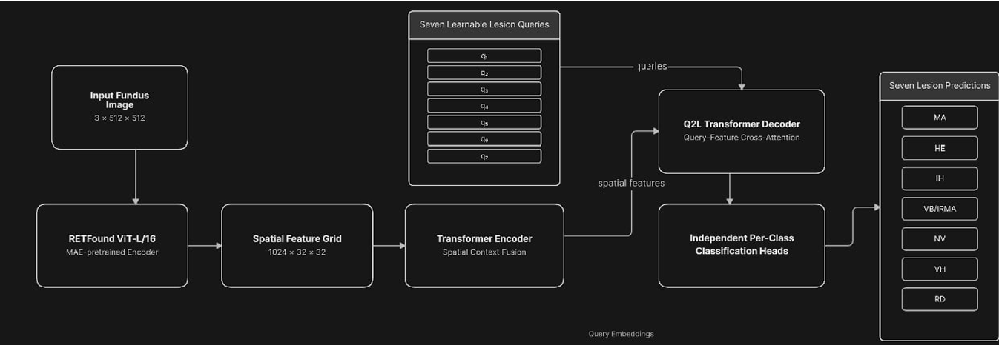
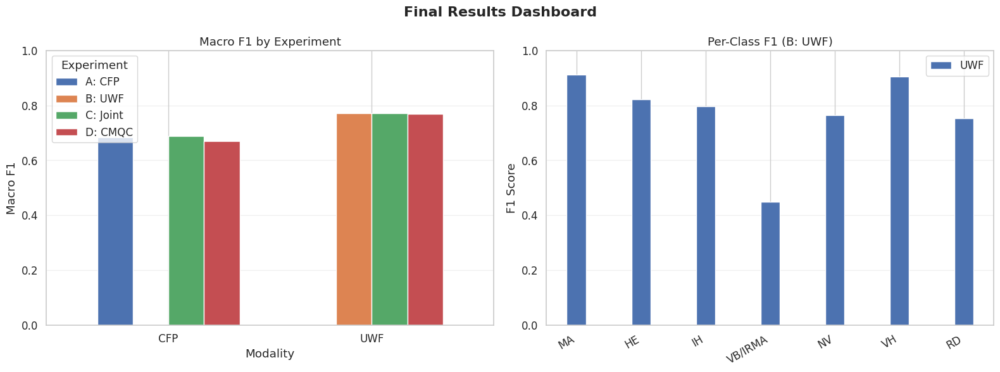
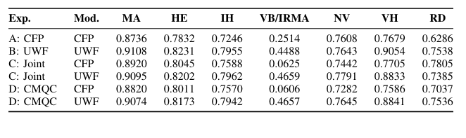

# Multimodal Retinal Lesion Detection with Query2Label

**RETFound ViT-Large/16 + Query2Label + Asymmetric Loss on the MMRDR dataset**

A research-oriented multi-label retinal lesion detection system for **seven lesion classes** across **Color Fundus Photography (CFP)** and **Ultra-Widefield (UWF)** imaging.

**Best test Macro F1:** **0.6843 (CFP)** and **0.7717 (UWF)** using validation-fitted per-class thresholds.

This project builds on the MMRDR multimodal retinal dataset and evaluates a controlled four-experiment study: CFP-only, UWF-only, joint training, and modality-conditioned joint training. Negative results are reported alongside successful results.

---

## Overview

Most diabetic retinopathy pipelines frame the task as single-label severity grading. This project instead treats retinal lesion recognition as **multi-label classification**, where several lesions may occur in the same image and lesion prevalence can differ substantially across modalities.

The system combines:

- **RETFound ViT-Large/16** — MAE-pretrained retinal foundation model
- **Query2Label (Q2L)** — seven learnable lesion-specific queries with transformer attention
- **Asymmetric Loss (ASL)** — designed for multi-label positive/negative imbalance
- **Effective-number class weighting** — additional handling of class imbalance
- **Per-class threshold optimization** — validation-fitted decision thresholds
- **Modality-balanced sampling** — used for joint CFP + UWF experiments
- **Conditional Modality Query Conditioning (CMQC)** — proposed and evaluated as a modality-aware extension

> **Backbone note:** The project was originally designed around ConvNeXt-V2-Base and was later migrated to RETFound ViT-Large/16. The reported results in this README are from the RETFound system. ConvNeXt-V2 is retained as the architectural starting point.

---

## Architecture



### Pipeline

**Input image (512×512) → RETFound ViT-Large/16 → token-to-grid adapter → Q2L Transformer Decoder → 7 lesion-specific classifier heads → ASL → per-class threshold optimization**

The RETFound backbone produces a token sequence. The adapter removes the CLS token and reshapes patch tokens into the spatial grid expected by the Q2L decoder.

| Component | Parameters |
|---|---:|
| RETFound ViT-Large/16 | 304,149,504 |
| Q2L decoder + classifier heads | 46,205,959 |
| **Total** | **350,355,463** |

Q2L uses:

- `d_model = 1024`
- 4 attention heads
- 1 encoder layer
- 2 decoder layers
- 7 lesion-specific queries
- Per-class classifier heads
- Optional DETR-style 2D sinusoidal positional encoding

The RETFound checkpoint's learned positional embeddings are interpolated from the pretrained 14×14 grid to the project's 32×32 grid.

---

## Problem Statement

The task has four important characteristics:

1. **Multi-label nature** — multiple lesions can occur in one image.
2. **Severe class imbalance** — RD occurs in ~0.8% of CFP training-pool images while MA occurs in ~39.6%.
3. **Modality-dependent prevalence** — VB/IRMA is ~2.2% prevalent in CFP versus ~10.0% in UWF.
4. **Threshold sensitivity** — a fixed 0.5 threshold performs poorly for several classes compared with validation-fitted thresholds.

The central research question is:

> **Can one shared model effectively serve both CFP and UWF without degrading modality-specific lesion detection?**

---

## Key Objectives

1. Evaluate RETFound + Q2L for multi-label retinal lesion detection.
2. Compare performance between CFP and UWF.
3. Measure the effect of joint CFP + UWF training.
4. Evaluate modality-aware query conditioning through CMQC.
5. Identify difficult lesion classes under severe imbalance.
6. Analyze modality-specific effects of joint training.

---

## Dataset

**MMRDR (Multi-Modal Retinal Disease Recognition)** provides CFP and UWF retinal images with per-lesion binary annotations.

| Modality | Images | Train Pool | Test |
|---|---:|---:|---:|
| CFP | 11,118 | 8,893 | 2,225 |
| UWF | 10,404 | 7,807 | 2,597 |
| **Total** | **21,522** | **16,700** | **4,822** |

The dataset uses a filename-prefix split:

- `tr*` → training pool
- `ts*` → test set

The training pool is further split 87.5% / 12.5% into training and validation using a fixed seed.

### Lesion prevalence

| Lesion | CFP | UWF |
|---|---:|---:|
| MA | 39.6% | 66.2% |
| HE | 24.1% | 36.6% |
| IH | 23.3% | 37.4% |
| VB/IRMA | 2.2% | 10.0% |
| NV | 4.9% | 11.4% |
| VH | 3.4% | 11.7% |
| RD | 0.8% | 2.2% |

Every listed lesion is more prevalent in UWF in the training pool, although the prevalence gap varies by class.

---

## Lesion Classes

| Index | Lesion | Abbreviation | DR Stage |
|---:|---|---|---|
| 0 | Microaneurysm | MA | Mild NPDR |
| 1 | Hard Exudate | HE | Moderate NPDR |
| 2 | Intraretinal Hemorrhage | IH | Moderate NPDR |
| 3 | Venous Beading / IRMA | VB/IRMA | Severe NPDR |
| 4 | Neovascularization | NV | PDR |
| 5 | Vitreous Hemorrhage | VH | PDR |
| 6 | Retinal Detachment | RD | PDR |

Each image is represented by a binary vector of seven lesion labels.

---

## Q2L Explanation

Query2Label replaces a global-pooled classification head with **one learnable query per lesion class**.

Each lesion query:

1. Attends to the spatial feature grid through cross-attention.
2. Builds a class-specific representation.
3. Produces one class logit through its own classifier head.

This allows different queries to specialize in different visual evidence rather than forcing one pooled representation to represent every lesion simultaneously.

---

## ASL / Class Imbalance Handling

The project combines several mechanisms to address severe multi-label imbalance:

### Asymmetric Loss

The reported runs use:

| Parameter | Value |
|---|---:|
| `gamma_pos` | 0.0 |
| `gamma_neg` | 6.0 |
| `clip` | 0.10 |
| Reduction | mean |

The reported configuration uses stronger negative focusing than the standard code defaults.

### Effective-number weighting

Class weights are computed from the effective number of samples with:

- `β = 0.999`
- weights computed from the training data
- weights registered as model buffers

### Additional techniques

- **Modality-balanced sampling** for Experiments C/D
- **CutMix / MixUp** with soft labels
- **Per-class threshold optimization** on validation data

---

## CMQC

**Conditional Modality Query Conditioning (CMQC)** is the project's proposed modality-aware modification.

In joint training, the same lesion queries are used for both modalities. CMQC adds a learned modality-specific offset:

```python
queries = label_queries
queries = queries + modality_offset[modality_id]
```

A two-row embedding table provides one 1024-dimensional offset for CFP and one for UWF.

**Result:** CMQC did not improve performance in this configuration. Experiment D underperformed the simpler joint model, so the modification is reported as a negative result rather than presented as an improvement.

---

## Experimental Setup

| Setting | Value |
|---|---|
| Image size | 512×512 |
| Backbone | RETFound ViT-Large/16 |
| Backbone training | Fully fine-tuned |
| Effective batch size | 16 |
| Optimizer | AdamW |
| Weight decay | 0.05 |
| Backbone LR | `1e-5` |
| Decoder LR | `1e-4` |
| LR schedule | 5-epoch linear warmup → cosine decay |
| Epochs | 75 |
| Early stopping | Patience 15 |
| Gradient clipping | 1.0 |
| AMP | Enabled |
| EMA | Enabled, decay 0.999 |
| Validation split | 12.5% |
| Class weighting | Effective number, β=0.999 |
| Threshold search | 0.05–0.95, step 0.05 |
| Seed | 42 |

Training uses resize, RandAugment, horizontal/vertical flips, ImageNet normalization, RandomErasing, and batch-level CutMix/MixUp.

Training was developed for GPU environments and uses checkpoint-based resume for interrupted runs.

---

## Experiment A–D

| Exp | Training Data | Balanced Sampling | CMQC | Purpose |
|---|---|---|---|---|
| **A** | CFP only | No | No | CFP-only baseline |
| **B** | UWF only | No | No | UWF-only baseline |
| **C** | CFP + UWF | Yes | No | Effect of naive joint training |
| **D** | CFP + UWF | Yes | Yes | Effect of modality conditioning |

Experiments C and D are evaluated separately on both CFP and UWF test sets.

---

## Evaluation Metrics

The primary metric is **Macro F1**, the unweighted mean of per-class F1 across all seven lesions.

Additional metrics include:

- Per-lesion F1
- Macro precision / recall
- Per-class accuracy
- Element-wise accuracy
- Exact Match
- ROC-AUC
- Per-class positive counts
- Per-class optimized thresholds

### Threshold optimization

Instead of using 0.5 for every class, a threshold is selected independently for each lesion by grid search on the validation set. The selected thresholds are then applied unchanged to the test set.

| Evaluation | CFP | UWF |
|---|---:|---:|
| Macro F1 @ 0.5 | 0.5589 | 0.6106 |
| Macro F1 @ optimized threshold | **0.6843** | **0.7717** |
| Improvement | +0.1254 | +0.1611 |

---

## Results

All main results below use **validation-fitted optimized per-class thresholds**.

### Main comparison

| Experiment | Test Set | Macro F1 | Accuracy | Exact Match |
|---|---|---:|---:|---:|
| **A: CFP-only** | CFP | **0.6843** | 0.9374 | 0.6881 |
| **B: UWF-only** | UWF | **0.7717** | 0.9074 | 0.5129 |
| **C: Joint** | CFP | **0.6876** | 0.9463 | 0.7258 |
| **C: Joint** | UWF | **0.7704** | 0.9067 | 0.5098 |
| **D: CMQC** | CFP | **0.6702** | 0.9445 | 0.7119 |
| **D: CMQC** | UWF | **0.7696** | 0.9052 | 0.5067 |



### Per-lesion F1

| Experiment | Test Set | MA | HE | IH | VB/IRMA | NV | VH | RD |
|---|---|---:|---:|---:|---:|---:|---:|---:|
| A: CFP-only | CFP | 0.8736 | 0.7832 | 0.7246 | **0.2514** | 0.7608 | 0.7679 | 0.6286 |
| B: UWF-only | UWF | 0.9108 | 0.8231 | 0.7955 | **0.4488** | 0.7643 | 0.9054 | 0.7538 |
| C: Joint | CFP | 0.8920 | 0.8045 | 0.7588 | **0.0625** | 0.7442 | 0.7705 | 0.7805 |
| C: Joint | UWF | 0.9095 | 0.8202 | 0.7962 | **0.4659** | 0.7791 | 0.8833 | 0.7385 |
| D: CMQC | CFP | 0.8820 | 0.8011 | 0.7570 | **0.0606** | 0.7282 | 0.7586 | 0.7037 |
| D: CMQC | UWF | 0.9074 | 0.8173 | 0.7942 | **0.4657** | 0.7645 | 0.8841 | 0.7536 |



### Comparison with the MMRDR ResNet-50 baseline

The original MMRDR work used a ResNet-50 backbone. Its approximate reported Macro F1 values are used here only as a reference because the baseline was not reproduced under the same evaluation harness.

| Modality | ResNet-50 baseline | Best result here | Difference |
|---|---:|---:|---:|
| CFP | ~0.671 | **0.6843** | +0.013 |
| UWF | ~0.774 | **0.7717** | −0.002 |

These numbers indicate comparable performance rather than a controlled improvement.

### Key findings

**1. UWF achieved higher Macro F1 than CFP.**  
The best single-modality results were 0.7717 on UWF and 0.6843 on CFP. UWF also has substantially higher lesion prevalence across the training pool.

**2. Joint training did not show a clear aggregate improvement.**  
Experiment C reached 0.6876 on CFP and 0.7704 on UWF. The observed differences from the single-modality baselines are small and cannot be interpreted reliably from a single seed.

**3. CMQC degraded performance in this configuration.**  
Experiment D reached 0.6702 on CFP and 0.7696 on UWF, below Experiment C on both test sets.

**4. VB/IRMA showed strong modality-specific negative transfer.**  
Its CFP F1 decreased from 0.2514 in Experiment A to 0.0625 in Experiment C, while UWF F1 increased from 0.4488 to 0.4659. This suggests that joint training can affect individual lesions differently across modalities.

**5. Threshold optimization had a substantial effect.**  
The gap between fixed and optimized thresholds shows that decision thresholds are important in this highly imbalanced multi-label setting.

---

## Generated Analysis Artifacts

| Artifact | Path |
|---|---|
| Architecture diagram | `outputs/archi.png` |
| Results summary | `outputs/Outputs/results.png` |
| Final dashboard | `outputs/Outputs/final_dashboard.png` |
| Complete results | `outputs/Outputs/complete_result.png` |
| Per-lesion results | `outputs/Outputs/RESULTS-PER-LESION.png` |
| Dataset overview | `outputs/Outputs/dataset_overview.png` |
| Modality conditioning | `outputs/Outputs/modality_conditioning.png` |
| PR curves | `outputs/Outputs/pr_c_cfp.png`, `pr_c_uwf.png` |
| ROC curves | `outputs/Outputs/roc_c_cfp.png`, `roc_c_uwf.png` |

---

## Project Structure

```text
.
├── train.py
├── evaluate.py
├── multimodel-q2l-retfound-local.ipynb
├── README.md
├── src/
│   ├── config.py
│   ├── backbone.py
│   ├── q2l_decoder.py
│   ├── model.py
│   ├── dataset.py
│   ├── losses.py
│   ├── metrics.py
│   ├── threshold.py
│   └── utils.py
├── @rp/                         # Reference papers
└── outputs/
    ├── archi.png
    ├── export/
    ├── Outputs/
    ├── exp_a_cfp/
    ├── exp_b_uwf/
    ├── exp_c_joint/
    └── exp_d_cmqc/
```

Each experiment directory contains configuration, metrics, threshold information, training history, logs, and checkpoints.

Large `.pth` checkpoints are multi-gigabyte artifacts and should generally be excluded from version control.

---

## Installation

Create a Python environment and install the dependencies used for the reported runs:

```bash
pip install torch==2.8.0 --index-url https://download.pytorch.org/whl/cu128
pip install timm==1.0.27 numpy==2.1.3 pandas==2.3.1 matplotlib==3.10.5
pip install scikit-learn Pillow psutil
```

A CUDA-capable GPU is required for training. The reference runs used a 16 GB GPU with gradient checkpointing and a fully fine-tuned RETFound ViT-Large backbone.

### Backbone weights

The RETFound backbone must be supplied separately as a local checkpoint:

```text
weights/RETFound_mae_meh.pth
```

The loader does not download weights automatically. The expected checkpoint is the raw RETFound `.pth` checkpoint; HuggingFace `config.json` + `model.safetensors` exports are not compatible with this loader.

---

## Dataset Preparation

Arrange the MMRDR dataset relative to the project root:

```text
dataset/
├── MMRDR-CFP/
│   ├── FP.csv
│   └── img/
│       ├── tr000001.jpg
│       └── ts000001.jpg
└── MMRDR-UWF/
    ├── UWF.csv
    └── img/
        ├── tr000001.jpg
        └── ts000001.jpg

weights/
└── RETFound_mae_meh.pth
```

Each CSV must contain at least:

| Column | Type | Example |
|---|---|---|
| `image` | string | `img/ts000001.jpg` |
| `lesion` | string | `"[0, 1, 0, 0, 1, 0, 0]"` |

Dataset roots and CSV filenames are configurable in `src/config.py`.

---

## Research Contributions

### Existing methods used

| Component | Source |
|---|---|
| RETFound ViT-Large/16 | Zhou et al., Nature, 2023 |
| Query2Label | Liu et al., 2021 |
| Asymmetric Loss | Ridnik et al., ICCV 2021 |
| Effective-number weighting | Cui et al., CVPR 2019 |
| ConvNeXt-V2 | Woo et al., CVPR 2023 |
| CutMix / MixUp / RandAugment / EMA | Prior work |
| MMRDR dataset and ResNet-50 baseline | MMRDR authors |

These components are existing methods and are not claimed as novel contributions of this project.

### Project-specific contributions

1. **Four-way modality ablation (A–D)** evaluating separate, joint, and modality-conditioned training.
2. **CMQC**, a lightweight modality-aware offset applied to Q2L lesion queries, evaluated as a negative result.
3. **RETFound-to-Q2L spatial adapter** with position-embedding interpolation and checkpoint validation.
4. **Integrated imbalance pipeline** combining ASL, effective-number weighting, modality-balanced sampling, and threshold optimization.
5. **VB/IRMA negative-transfer analysis** showing that aggregate Macro F1 can hide severe modality-specific class degradation.
6. **Checkpoint-resilient training harness** supporting interruption-safe resume and resource diagnostics.

---

## Limitations

- **CMQC did not improve performance** in the tested configuration.
- **No clear cross-modal transfer benefit** was demonstrated by joint training.
- **VB/IRMA remains a major failure case**, particularly for CFP under joint training.
- Results use a **single random split and single seed (42)**; variance estimates are unavailable.
- The ResNet-50 comparison is **approximate** and was not reproduced under the same evaluation harness.
- Thresholds are fitted on validation data before being applied to test data.
- No external retinal dataset was used for validation.
- The backbone was fully unfrozen and layer-wise LR decay was not used in the reported runs.
- The checkpoints are large and should generally not be committed to source control.

---

## Future Work

- Redesign CMQC using per-query modality conditioning or FiLM-style conditioning.
- Develop a dedicated strategy for the VB/IRMA modality imbalance and negative transfer.
- Run multi-seed and k-fold experiments to quantify uncertainty.
- Reproduce the ResNet-50 baseline under the same evaluation harness.
- Evaluate the model on independent retinal datasets.
- Investigate calibration methods to reduce dependence on per-class threshold search.
- Package the existing export path into a standalone inference workflow.

---

## References

1. Liu, S., et al. **Query2Label: A Simple Transformer Way to Multi-Label Classification.** 2021.
2. Ridnik, T., et al. **Asymmetric Loss for Multi-Label Classification.** ICCV 2021.
3. Woo, S., et al. **ConvNeXt V2: Co-Designing and Scaling ConvNets with Masked Autoencoders.** CVPR 2023.
4. Zhou, Y., et al. **A Foundation Model for Generalizable Disease Detection from Retinal Images.** Nature, 2023. — RETFound
5. Cui, Y., et al. **Class-Balanced Loss Based on Effective Number of Samples.** CVPR 2019.
6. Yun, S., et al. **CutMix: Regularization Strategy to Train Strong Classifiers with Localizable Features.** ICCV 2019.
7. Zhang, H., et al. **mixup: Beyond Empirical Risk Minimization.** ICLR 2018.
8. Carion, N., et al. **End-to-End Object Detection with Transformers.** ECCV 2020. — DETR positional encoding

### Baseline paper

**A multimodal retinal image dataset for diabetic retinopathy detection using foundation models**

https://www.researchgate.net/publication/401807874_A_multimodal_retinal_image_dataset_for_diabetic_retinopathy_detection_using_foundation_models

---

## Acknowledgements

This work builds on the MMRDR multimodal retinal dataset and its ResNet-50 baseline, and uses the RETFound foundation model, Query2Label architecture, and Asymmetric Loss.
